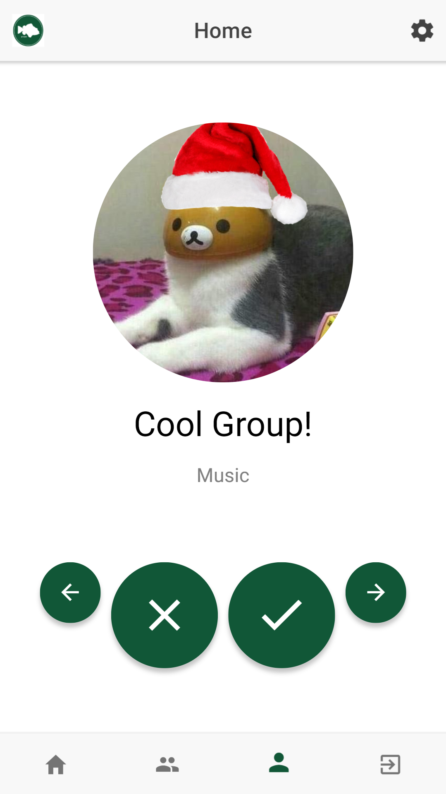
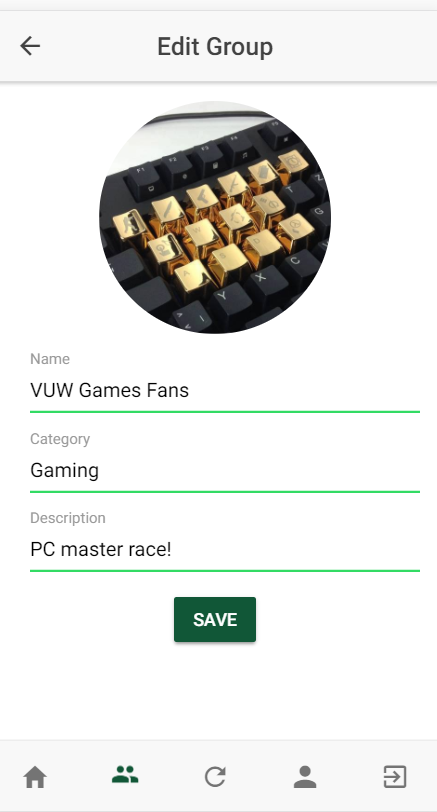
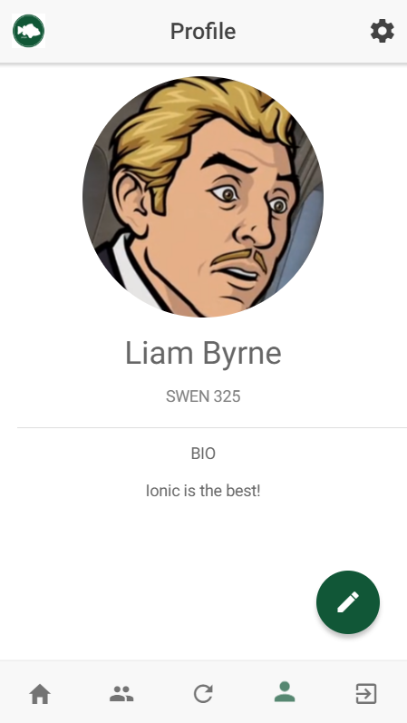

# grouper

**Grouper** is a group finder tuned to Victoria University. Grouper aims to solve the complexity of finding groups of like-minded people for the purposes of coursework, tutoring or socialising by introducing a simple and intuitive interface for searching groups within the University.

Features:
- Azure AD authentication to ensure only genuine VUW students use the app
- Creating profiles with custom info and images
- Easily find and join groups with the swipe interface
- Create, edit and manage groups with only a few taps
- Hiding groups that aren't of interest

#### [Check it out here!](https://mcmanaway1.github.io)

This app uses the Ionic framework and was produced for SWEN 325 at Victoria University of Wellington.

Developers:
- Liam Byrne (https://github.com/byrneliam2)
- Andrew McManaway (https://github.com/mcmanaway1)
